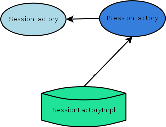

[[_jdiameter_design]]
= Diameter Stack Design

[[_jdiameter_design_extensibility]]
== Diameter Stack Extensibility

Diameter Stack has been designed to be extensible.
In order to achieve that, two set of APIs are defined by the stack - one that defines basic contracts between the user application and the stack, and one that defines contracts allowing the instance to inject custom objects into the stack to perform certain tasks (for example, [class]`SessionFactory`). [class]`ISessionFactory` declares additional methods that allow the developer to declare custom behaviour (for example, custom application sessions). Please refer to <<_jdiameter_source_overview_session_factory>> for more detailed information. 

.Diameter Stack Extensibility Visualization

The general pattern for interface declaration is: 

* The interface `ComponentInterface` declares the minimal set of methods for a component to perform its task. 
* The interface `IComponentInterface` provides additional behavior methods.
  Please refer to the java doc for a list of interfaces and descriptions of method contracts. 

[[_jdiameter_design_model]]
== Diameter Stack Model

Diameter Stack performs the following tasks:

* Manages connections to remote peers.
* Manages session objects.
* Routes messages on behalf of sessions.
* Receives and delivers messages to assigned listeners (usually a session object).

Sessions use the stack and the services it provides to communicate with remote peers.
The application is the only place that holds references to sessions.
It can be seen as follows:

.Diameter Application and Stack Model
image::images/DIA_2_x_JD_stack_model.png[]

[[_jdiameter_app_session_factories]]
== Application Session Factories

Application session factories perform two tasks:

* server stack as factory for sessions.
* server session objects as holders for session related resources, like state change listener, event listeners and context. 

The figure below shows the relationship between Application Session Factories and User Applications: 

.Application Session Factory and User Application
image::images/DIA_2_x_JD_stack_appsession_1.png[]

NOTE: Session context is a callback interface defined by some sessions. 

== Session Replication

Diameter Stack supports replication of session data and state.
Clustered stack instances can perform operations on session regardless of physical location.
Imagine the logically clustered stack as follows:  

.Diameter Cluster
image::images/DIA_2_x_JD_stack_cluster_1.png[]

Stack only replicates non simple sessions.
This is because simple sessions do not hold state and can be simply recreated by the application.
Simple sessions include:

* RawSessions
* Sessions

Diameter Cluster replicates the full state of sessions.
However, it does not replicate resources that are entirely local to the stack instance, like session listeners.
Local resource references are recreated once the session is being prepared to be used in the stack instance.
Listeners (state and events) are fetched from the respective session factory instance.
See <<_jdiameter_app_session_factories>> for more details. 